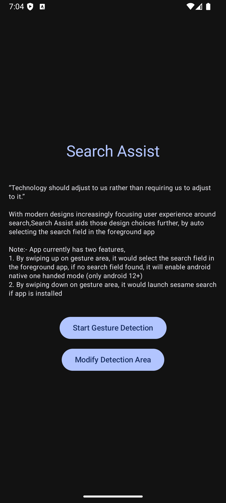
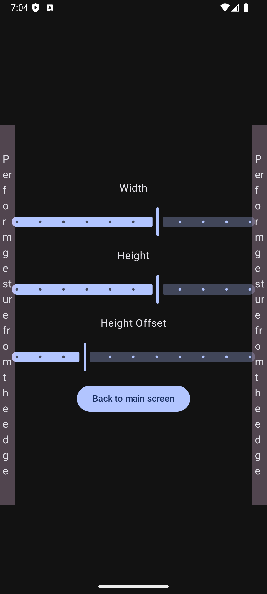

# Search Assist Android Application

**Search Assist** is an Android application that allows users to quickly access the search bar of any foreground application by swiping from the screen's edge. It uses Android Accessibility API's to detect search bars or icons automatically.

## Features

- **Edge Swipe Gesture:** Trigger search bar selection by swiping from the edge of the screen.
- **Customizable Edge Width:** Adjust the swipe detection area width via the settings UI.
- **Material 3 Design:** The app follows Google's Material 3 guidelines and uses Jetpack Compose for UI.
- **Accessibility Service:** Utilizes accessibility services to interact with other apps.

## Screenshots

<span>


</span>

## Installation

1. Clone the repository:
   ```sh
   git clone https://github.com/krish-199/SearchAssist.git
   ```
2. Open the project in Android Studio.
3. Sync the Gradle files.
4. Run the application on an emulator or physical device.

## Usage

1. Launch the app.
2. Adjust the edge detection width using the slider.
3. Enable Search Assist by tapping the "Enable Search Assist" button.
4. Swipe from the screen edge to activate the search bar detection.

## Project Structure

```
com.krishdev.searchassist
├── MainActivity.kt          # Main entry point of the app
├── ui/theme                 # Material 3 UI theme setup
├── service                  # Accessibility service handling OCR and gesture detection
├── EdgeGestureDetector.kt   # Gesture recognition logic
└── utils                    # Helper utilities
```

## Dependencies

Ensure the following dependencies are included in your `build.gradle`:

```gradle
implementation "androidx.activity:activity-compose:1.8.0"
implementation "androidx.compose.material3:material3:1.5.0"
implementation "androidx.compose.ui:ui:1.5.0"
implementation "androidx.lifecycle:lifecycle-runtime-ktx:2.6.1"
implementation "com.google.mlkit:text-recognition:16.0.0"
```

## Requirements

- **Android Version:** Minimum SDK 25 (Lollipop)
- **Kotlin Version:** 1.9.0
- **Jetpack Compose Version:** 1.5.0 or later

## Known Issues

- Some apps may not allow accessibility services to interact with their UI.
- Edge detection may not work well on devices with edge gestures enabled by default.

## Contributing

Contributions are welcome! Please follow these steps:

1. Fork the repository.
2. Create a new branch.
3. Make your changes and commit.
4. Open a pull request.

## License

This project is licensed under the MIT License.

```
MIT License

Copyright (c) 2025

Permission is hereby granted, free of charge, to any person obtaining a copy
of this software and associated documentation files (the "Software"), to deal
in the Software without restriction, including without limitation the rights
to use, copy, modify, merge, publish, distribute, sublicense, and/or sell
copies of the Software, and to permit persons to whom the Software is
furnished to do so, subject to the following conditions:

The above copyright notice and this permission notice shall be included in all
copies or substantial portions of the Software.

THE SOFTWARE IS PROVIDED "AS IS", WITHOUT WARRANTY OF ANY KIND, EXPRESS OR
IMPLIED, INCLUDING BUT NOT LIMITED TO THE WARRANTIES OF MERCHANTABILITY,
FITNESS FOR A PARTICULAR PURPOSE AND NONINFRINGEMENT. IN NO EVENT SHALL THE
AUTHORS OR COPYRIGHT HOLDERS BE LIABLE FOR ANY CLAIM, DAMAGES OR OTHER
LIABILITY, WHETHER IN AN ACTION OF CONTRACT, TORT OR OTHERWISE, ARISING FROM,
OUT OF OR IN CONNECTION WITH THE SOFTWARE OR THE USE OR OTHER DEALINGS IN THE
SOFTWARE.
```

